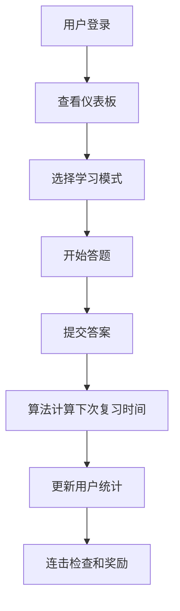
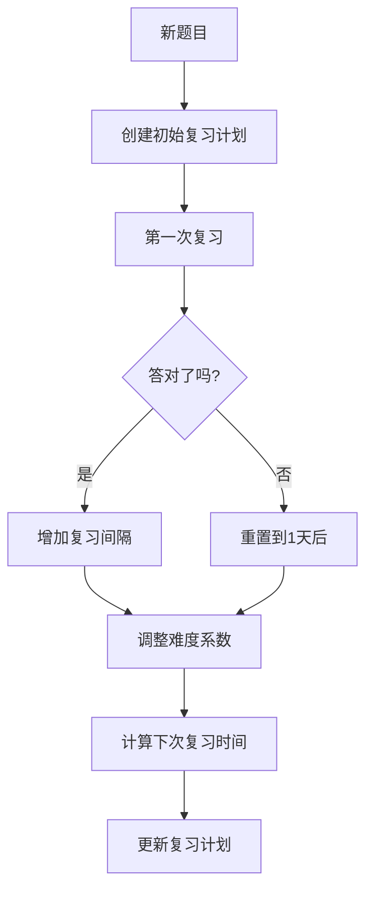

# PTE/雅思记忆助手 - 智能备考系统

基于艾宾浩斯遗忘曲线的PTE/雅思备考系统，集成智能复习提醒、连击挑战、互动游戏和语音功能的现代化学习平台。

## 🌟 核心特性

### 📚 智能错题管理
- **多类型题目支持**: 听说读写四个模块完整覆盖
- **详细错误分析**: 记录错误原因、正确答案和解析
- **智能分类标签**: 自定义标签系统便于管理
- **难度等级评估**: 5级难度自动评估和手动调整

### 🧠 艾宾浩斯遗忘曲线算法
- **SM-2算法实现**: 基于SuperMemo 2的科学记忆算法
- **个性化间隔**: 根据答题表现动态调整复习间隔
- **记忆强度计算**: 实时评估记忆保持概率
- **优先级排序**: 智能安排复习优先级

### ⚡ 连击挑战系统
- **连击奖励机制**: 连续答对获得经验加成
- **等级系统**: 从"刚刚开始"到"传奇大师"5个等级
- **实时动画效果**: 炫酷的连击特效和声音反馈
- **成就解锁**: 3连、5连、10连等里程碑奖励

### 🎵 音频与语音功能
- **音频播放器**: 支持MP3等格式的听力材料
- **TTS语音合成**: Web Speech API实现文字转语音
- **播放控制**: 暂停、重播、音量调节等完整控制
- **语音设置**: 支持多语言、语速、音调调节

### 🎮 互动小游戏
- **单词配对游戏**: 英文单词与中文释义配对
- **计时挑战**: 限时完成增加游戏紧张感
- **分数系统**: 基于速度和准确率的综合评分
- **动画效果**: 流畅的卡片翻转和匹配动画

### 📊 学习统计分析
- **详细数据面板**: 全方位学习数据可视化
- **进度追踪**: 日常目标设定和完成情况
- **准确率分析**: 按题型、时间段的准确率统计
- **学习趋势**: 长期学习效果趋势分析

## 🛠 技术架构

### 前端技术栈
```
Next.js 14          # React框架，App Router
TypeScript          # 类型安全
Tailwind CSS        # 样式框架
Framer Motion       # 动画库
React Hook Form     # 表单处理
Recharts           # 数据图表
Socket.io Client    # 实时通信
```

### 后端技术栈
```
Go 1.21            # 后端语言
Gin                # Web框架
GORM               # ORM框架
PostgreSQL         # 数据库
JWT                # 身份认证
WebSocket          # 实时通信
```

### 核心算法
```
SM-2 Algorithm     # 间隔重复算法
Ebbinghaus Curve   # 遗忘曲线模型
Priority Queue     # 复习优先级队列
```

## 🚀 快速开始

### 环境要求
- Node.js 18+
- Go 1.21+
- PostgreSQL 12+

### 前端启动
```bash
cd frontend
npm install
npm run dev
```

### 后端启动
```bash
cd backend
go mod tidy
go run main.go
```

### 数据库配置
```bash
# 创建数据库
createdb pte_memory_db

# 配置环境变量
cp .env.example .env
# 编辑 .env 文件设置数据库连接
```

## 📁 项目结构

```
pte-memory-app/
├── frontend/                   # Next.js前端
│   ├── app/                   # App Router页面
│   │   ├── auth/             # 认证页面
│   │   ├── dashboard/        # 仪表板
│   │   ├── questions/        # 题目管理
│   │   ├── review/           # 复习页面
│   │   └── games/            # 游戏页面
│   ├── components/           # 可复用组件
│   │   ├── AudioPlayer.tsx   # 音频播放器
│   │   ├── StreakCounter.tsx # 连击计数器
│   │   └── WordMatchGame.tsx # 单词配对游戏
│   ├── contexts/             # React上下文
│   ├── lib/                  # 工具库
│   └── styles/               # 样式文件
│
├── backend/                   # Go后端
│   ├── config/               # 配置文件
│   ├── controllers/          # 控制器
│   ├── models/               # 数据模型
│   ├── services/             # 业务服务
│   ├── middleware/           # 中间件
│   ├── routes/               # 路由配置
│   └── database/             # 数据库连接
│
└── docs/                     # 项目文档
```

## 🎯 核心业务流程

### 1. 用户学习流程


### 2. 艾宾浩斯算法流程


## 📊 数据库设计

### 核心表结构
```sql
-- 用户表
users (id, username, email, password, level, xp, streak)

-- 题目表
questions (id, user_id, title, content, question_type, difficulty_level)

-- 复习计划表
review_schedules (id, question_id, current_interval, ease_factor, next_review_date)

-- 复习会话表
review_sessions (id, user_id, question_id, is_correct, confidence_level, response_time)

-- 用户统计表
user_stats (id, user_id, total_questions, accuracy_rate, study_days)
```

## 🎨 UI/UX设计特点

### 设计原则
- **清晰直观**: 简洁的界面设计，功能一目了然
- **响应式**: 完美适配桌面、平板和移动端
- **动效反馈**: 丰富的动画效果增强用户体验
- **色彩系统**: 基于学习心理学的色彩搭配

### 组件库特性
- **模块化设计**: 高度可复用的组件系统
- **主题支持**: 支持明暗主题切换
- **无障碍**: 遵循WCAG 2.1无障碍标准
- **国际化**: 支持多语言切换

## 🔧 部署指南

### Docker部署
```bash
# 构建镜像
docker-compose build

# 启动服务
docker-compose up -d
```

### 生产环境配置
```bash
# 前端构建
npm run build

# 后端编译
go build -o main

# 数据库迁移
./main migrate

# 启动服务
./main serve
```

## 📈 性能优化

### 前端优化
- Next.js 14 App Router提供更好的性能
- 图片懒加载和压缩
- 代码分割和按需加载
- Service Worker缓存策略

### 后端优化
- 数据库索引优化
- Redis缓存热点数据
- API响应压缩
- 连接池配置

## 🤝 贡献指南

### 开发规范
- 使用TypeScript进行类型检查
- 遵循ESLint和Prettier代码格式
- 提交前运行测试用例
- 编写清晰的commit message

### 代码提交流程
```bash
# 创建功能分支
git checkout -b feature/new-feature

# 提交代码
git commit -m "feat: add new feature"

# 推送分支
git push origin feature/new-feature

# 创建Pull Request
```

## 📞 技术支持

- **GitHub Issues**: [项目问题反馈](https://github.com/your-repo/issues)
- **文档中心**: [在线文档](https://docs.your-domain.com)
- **邮箱支持**: support@your-domain.com

## 📄 许可证

本项目采用 MIT 许可证 - 查看 [LICENSE](LICENSE) 文件了解详情。

---

**Made with ❤️ for PTE/IELTS learners worldwide**